  <h1>Hi there, I'm Ganesh Ganapathi! 👋</h1>
  

    <b>Aspiring Software Development Engineer</b> 
    Integrated M.Tech in Computer Science @ VIT Chennai 
    <i>Building scalable backend systems, APIs, and data-driven applications.</i>
  

  

    
    
  

 

---

<!-- BIO SECTION FROM RESUME -->
### 👨‍💻 About Me
I am a passionate software developer with a strong foundation in **Data Structures, Algorithms, and System Design**. I specialize in building efficient backend architectures and integrating AI/ML models into real-world applications.

- 🔭 I’m currently working on **IoT microservices and scalable data pipelines.**
- 🎓 **Education:** Integrated M.Tech in CS (Business Analytics) at **VIT, Chennai**.
- 💼 **Experience:**
  - **AI/ML & Data Analyst Intern** @ Arista Vault (Python, IoT, APIs)
  - **Transformational AI Intern** @ Kumaran Systems (R&D, Automation)
  - **Machine Learning Intern** @ EiSystems (Supervised Learning)

---

<!-- SKILLS SECTION MAPPED FROM RESUME -->
### 🛠 Tech Stack

| **Languages** | **Backend & Systems** | **AI & Data** | **Databases & Tools** |
|:---:|:---:|:---:|:---:|
|     |           |        |        |

---

<!-- METRICS GENERATED IMAGE -->
### 📊 GitHub Stats

  

---

<!-- PROJECTS SECTION FROM RESUME -->
### 🚀 Featured Projects

| Project | Tech Stack | Description |
| :--- | :--- | :--- |
| **Distributed Search Engine** | Python, Multithreading, SQLite | Designed an inverted-index search engine supporting ranked keyword queries. Optimized latency to **sub-100ms** via caching. |
| **Recommendation API** | Flask, Docker, Redis | Built a REST API for real-time movie recommendations using collaborative filtering. Reduced response time by **45%** with Redis. |
| **Skin Disease Classification** | Deep Learning, CNN, TensorFlow | Developed CNN architecture for classifying skin diseases. Improved accuracy by **12%** using Adam optimizer and data augmentation. |

 

  

